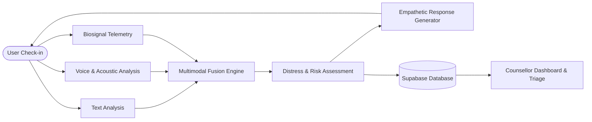

# Mann Shathi — Multimodal Mental Health & Distress Monitoring Platform

An intelligent, trauma-informed mental health monitoring and crisis triage platform designed to support victims and empower counsellors through real-time **Text**, **Voice/Acoustic**, and **Biosignal** multimodal analysis.

---

## Overview

Individuals experiencing trauma, stress, or psychological distress often mask their true emotional state in words alone or struggle to articulate their suffering. Traditional mental health monitoring systems rely on simple self-reporting surveys or isolated text chat, which can miss critical warning signs.

**Mann Shathi** solves this by:
1. Providing an empathetic, trauma-informed conversational companion for victims.
2. Continuously assessing distress through **multimodal signal analysis** (Text + Voice + Physiological Biosignals).
3. Detecting **emotional dissonance** (e.g., masking distress behind cheerful words).
4. Alerting counsellors with prioritized cases, longitudinal distress trends, and contextual legal/relief recommendations.

---

## How It Works

The platform processes inputs through three independent modality pipelines, fuses the indicators into a unified distress metric, generates an empathetic response, and updates the counsellor triage dashboard in real time.



---

## Multimodal Analysis

The system evaluates mental health by examining three independent channels before combining them in the fusion layer.

### 1. Text Analysis
* **Emotional Classification:** Uses a fine-tuned **DistilRoBERTa** transformer sequence classification model (`j-hartmann/emotion-english-distilroberta-base`) to calculate exact probabilities across 7 core emotion categories: *Sadness, Fear, Anger, Joy, Surprise, Disgust, and Neutral*.
* **Linguistic & Disfluency Markers:** Analyzes speech transcripts and typed text for hesitation markers (*um, uh, hmm, ah*), word repetitions (stuttering/anxiety markers), and uncertainty phrases (*"I don't know"*, *"maybe"*, *"worried"*).
* **Safety Pattern Recognition:** Scans for crisis and self-harm keywords (*"suicide"*, *"hurt myself"*, *"want to die"*) to trigger immediate safety protocols.

### 2. Voice & Acoustic Analysis
* **Speech Recognition & Disfluency Steering:** Uses **Faster-Whisper** with Voice Activity Detection (VAD) and custom disfluency steering prompts to capture exact transcripts, timestamps, speech duration, and silence ratios without omitting hesitations.
* **Vocal Emotion Recognition:** Uses a fine-tuned **Wav2Vec2** audio classification model (`superb/wav2vec2-base-superb-er`) on resampled 16 kHz audio to classify vocal emotion confidence (*Sad, Angry, Happy, Neutral*).
* **Acoustic Signal Features:** Uses **Librosa** to extract:
  * **Pitch (F0) Dynamics:** Mean pitch and pitch variability/jitter using the YIN fundamental frequency algorithm.
  * **RMS Energy Variability:** Voice volume fluctuations and vocal tremor under stress.
  * **Speech-to-Silence Ratio & Pause Duration:** Pauses and hesitation times indicating cognitive load or emotional suppression.

### 3. Biosignal Analysis
* **Physiological Metric Collection:** Ingests biometric telemetry from wearable sensors (e.g., smartbands/health monitors):
  * **Heart Rate Dynamics:** Resting BPM, mean BPM, and heart rate variability (HRV) spikes.
  * **Galvanic Skin Response (GSR/EDA):** Electrodermal skin conductance baseline and peak stress events.
  * **Sleep Architecture:** Sleep duration, sleep quality, nocturnal disturbances, and sleep recovery efficiency.
  * **Blood Oxygen ($SpO_2$) & Respiratory Rate:** Oxygenation and breathing stability.
* **Holistic Assessment:** Compares current vitals against a personalized baseline to identify physiological strain (e.g., elevated sympathetic nervous system activity combined with sleep deprivation).

---

## Multimodal Fusion

The **Fusion Engine** synthesizes the extracted modalities into a calibrated distress index ($0.0$ to $1.0$ / $0\%$ to $100\%$) and maps it to actionable clinical risk tiers:

```
[0.00 – 0.25] LOW  |  [0.26 – 0.50] MODERATE  |  [0.51 – 0.75] HIGH  |  [0.76 – 1.00] SEVERE
```

### Fusion Stages:
1. **Non-Linear Emotional Distress Pooling:** Combines vocal distress ($D_{\text{voice}} = \text{Sad} + \text{Angry}$) and textual distress ($D_{\text{text}} = \text{Sadness} + \text{Fear} + \text{Anger}$) with priority on the peak distress signal:
   $$\text{Emotional Distress} = 0.70 \times \max(D_{\text{voice}}, D_{\text{text}}) + 0.30 \times \text{avg}(D_{\text{voice}}, D_{\text{text}})$$
2. **Bidirectional Affective Dissonance:** Detects emotional conflict (e.g., speaking sad content in an upbeat tone, or expressing happiness with underlying vocal tension):
   $$\text{Dissonance} = \max(\text{Text}_{\text{Joy}} \times D_{\text{voice}},\; D_{\text{text}} \times \text{Voice}_{\text{Happy}})$$
3. **Conversational Disfluency Modulation:** Scales the base distress score using speech pauses, hesitation count, and uncertainty markers without overwhelming the baseline.

---

## AI / Model Integration

| Model / AI Component | Purpose | Input | Output |
| :--- | :--- | :--- | :--- |
| **DistilRoBERTa (Sequence Classification)** | Text Emotion Analysis | Raw user text / transcript | 7-class emotion probabilities |
| **Wav2Vec2 (Audio Classification)** | Vocal Tone Emotion Analysis | 16 kHz PCM Audio WAV | 4-class vocal emotion probabilities |
| **Faster-Whisper (STT + VAD)** | Speech-to-Text & Voice Activity | User voice recording | Transcript, word timestamps, pause durations |
| **Librosa Acoustic Engine** | Acoustic Prosody & Pitch Analysis | User voice recording | Pitch variability, RMS energy, silence ratios |
| **Groq LLM (e.g., LLaMA / Mixtral)** | Empathetic Response Generation | Conversation context + distress tier | Empathetic reply + follow-up question |
| **Vector Similarity (RAG Engine)** | Legal & Relief Provision Matching | Distress context & Case state | Relevant legal rights & welfare provisions |

*Note: If external LLM API keys are unavailable, the system automatically engages an intelligent rule-based conversational fallback engine to maintain continuous offline functionality.*

---

## Data & Supabase

**Supabase (PostgreSQL)** serves as the persistent database and authentication layer:

* **Authentication:** Role-based access control separating victims and verified counsellors.
* **Case Management (`cases`, `consents`):** Tracks victim enrollment, case status (`active`/`closed`), and data sharing consent preferences.
* **Turn-by-Turn Check-Ins (`check_ins`):** Stores timestamped conversation records, transcripts, channel type (`text` or `voice`), and sentiment indicators.
* **Distress Scores (`distress_scores`):** Logs fused distress scores, individual sub-modality breakdowns, baseline deviations, and trend flags.
* **Counsellor Alerts (`alerts`):** Automatically registers threshold-breaching events ($> 70\%$ distress) linked directly to the triggering session.
* **Legal Knowledge Base (`provisions`):** Embeddings and text chunks of victim rights, legal provisions (e.g., SC/ST Act, victim compensation schemes), and witness protection guidelines.

---

## System Workflow

```
1. Victim Input ──> Victim submits a text message or voice recording in the chat interface.
2. Modality Analysis ──> Text, Voice, and Biosignals are processed independently in parallel.
3. Multimodal Fusion ──> The Fusion Engine calculates total distress, dissonance, and risk tier.
4. AI Response ──> An empathetic, trauma-sensitive reply is returned to the victim immediately.
5. Persistent Logging ──> Check-in details and distress metrics are securely stored in Supabase.
6. Alert & Triage ──> If distress is HIGH or SEVERE, an alert is triggered on the Counsellor Dashboard with relevant legal and relief recommendations.
```

---

## Tech Stack

* **Frontend:** React 19, TypeScript, Vite, Tailwind CSS, Recharts
* **Backend:** Python 3.10+, FastAPI, Uvicorn, Pydantic
* **Machine Learning & Audio:** PyTorch, Hugging Face Transformers (`DistilRoBERTa`, `Wav2Vec2`), Faster-Whisper, Librosa, PyAV
* **LLM & RAG:** Groq API, Custom RAG Engine
* **Database & Auth:** Supabase (PostgreSQL, Vector Storage, Supabase Auth)

---

## Local Setup

### Prerequisites
* Python 3.10 or higher
* Node.js 18+ and npm
* Git

---

### 1. Clone the Repository
```bash
git clone <repository_url>
cd SIH
```

---

### 2. Backend Setup

1. **Create and activate a virtual environment:**
   ```bash
   # Windows (PowerShell)
   python -m venv venv
   .\venv\Scripts\Activate.ps1

   # Linux / macOS
   python3 -m venv venv
   source venv/bin/activate
   ```

2. **Install Python dependencies:**
   ```bash
   pip install -r requirements.txt
   ```

3. **Configure Environment Variables:**
   Create a `.env` file in the root directory:
   ```env
   # Supabase Configuration
   SUPABASE_URL=https://your-project.supabase.co
   SUPABASE_KEY=your_supabase_anon_or_service_key

   # LLM Configuration (Optional - fallback active if omitted)
   GROQ_API_KEY=your_groq_api_key
   GROQ_MODEL=openai/gpt-oss-120b
   ```

4. **Start the FastAPI server:**
   ```bash
   python -m uvicorn backend.app.main:app --reload --port 8000
   ```
   *The backend will be available at `http://localhost:8000` (API documentation at `http://localhost:8000/docs`).*

---

### 3. Frontend Setup

1. **Navigate to the frontend directory:**
   ```bash
   cd frontend
   ```

2. **Install Node dependencies:**
   ```bash
   npm install
   ```

3. **Start the Vite development server:**
   ```bash
   npm run dev
   ```
   *The web application will be accessible at `http://localhost:5173`.*

---

## Key Features

* 🎙️ **Dual-Mode Check-Ins:** Seamless text and speech check-ins with in-browser voice recording and waveform feedback.
* 🧠 **Multimodal Distress Scoring:** Non-linear combination of text emotions, speech tone, acoustic parameters, and biosignals.
* 🎭 **Affective Dissonance Detection:** Identifies discrepancies between verbal expression and acoustic emotion.
* 📊 **Longitudinal Counsellor Dashboard:** Real-time patient triage, baseline tracking, and trend charts.
* ⚖️ **Contextual Legal/Relief RAG:** Automatic retrieval of relevant legal protections and welfare schemes for active cases.
* 🛡️ **Offline & Fallback Resilient:** Rule-based conversational and analytical engines guarantee uptime even during external API downtime.

---

## Future Scope

* ⌚ **Direct IoT Wearable Integration:** Real-time Bluetooth Low Energy (BLE) streaming from commercial smartbands.
* 🌐 **Multilingual & Regional Dialect Support:** Expanding speech and emotion models to Indian regional languages (Hindi, Tamil, Telugu, etc.).
* 📱 **Native Mobile Companion:** React Native mobile application with offline-first voice journaling.
